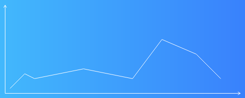

# pure-js-chart

pure js line-chart render to png ,no canvas or any browser apis, all in javascript

纯粹使用js实现的一个线形图表，可以直接输出png，不使用canvas或者其他浏览器接口，只有js



## usage

```js
const chart = require('./chart').create({width: 500, height: 200});
let datas = [24, 57, 70, 100, 130, 120, 110, 170, 160, 110];
let pngArrayBuffer = chart.draw(datas);

//save to file
require('fs').writeFileSync('output.png', Buffer.from(pngArrayBuffer));
//or covert to dataurl
let dataURL = 'data:image/png;base64,' + Buffer.from(pngArrayBuffer).toString('base64');

```

react native example:https://snack.expo.io/Cs2ScHaBC

```js
import React, { Component } from 'react';
import { Text, View, Image } from 'react-native';
import { create } from 'pure-js-chart';
import { Buffer } from 'buffer';

const chart = create({ width: 500, height: 200 });

export default class App extends Component {
  constructor(props) {
    super(props);

    let datas = [24, 57, 70, 100, 130, 120, 110, 170, 160, 110];
    let pngArrayBuffer = chart.draw(datas);
    let dataURL =
      'data:image/png;base64,' + Buffer.from(pngArrayBuffer).toString('base64');

    this.state = {
      img: dataURL,
    };
  }

  render() {
    return (
      <View>
        <Text>Hello, world!</Text>
        <Image
          resizeMode="contain"
          style={{ width: 300, height: 200 }}
          source={{ url: this.state.img }}
        />
      </View>
    );
  }
}

```

## thanks to

- [Xiaolin Wu's line algorithm](https://en.wikipedia.org/wiki/Xiaolin_Wu%27s_line_algorithm)
- [Dr. Dobb's Journal.Bresenham's algorithm ](https://en.wikipedia.org/wiki/Bresenham%27s_line_algorithm)
- [UPNG](https://github.com/photopea/UPNG.js)
- [pako](https://github.com/nodeca/pako)

## author
https://github.com/play175/pure-js-chart
